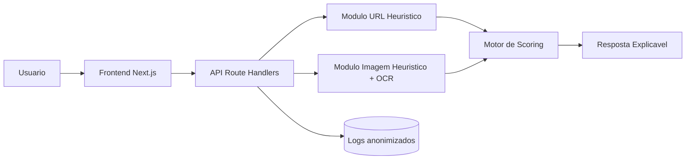
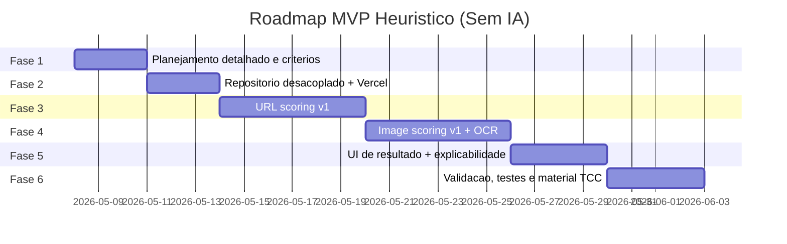

# 📦 Projeto: CadenceCode SafeCheck (MVP Heurístico)

## Visão Geral
**Objetivo:** disponibilizar um sistema público para verificação de segurança/autenticidade de URLs e imagens (prints), retornando uma porcentagem de segurança com recomendações práticas.

**Escopo (MVP):**
- Análise de URL por heurísticas (sem IA/ML).
- Análise de imagem por regras + OCR (sem IA/ML).
- Resultado explicável: score, fatores encontrados e dicas.
- Publicação pública no Vercel, desacoplada do projeto atual.

**Fora de escopo (MVP):**
- Treinamento de modelos de IA.
- App mobile nativo.
- Garantia legal de segurança absoluta.
- Monetização por publicidade nesta fase.

**Critérios de Sucesso:**
- Usuário envia URL ou imagem e recebe score de segurança (0-100).
- Resposta apresenta no mínimo 3 explicações objetivas.
- Deploy público funcional no Vercel.
- Base documental pronta para demonstração no TCC.

## Contexto e Motivação
Projeto da CadenceCode com aplicação acadêmica (TCC) e utilidade pública. A prioridade inicial é viabilidade técnica com custo zero para o usuário final, usando abordagem heurística transparente.

## Arquitetura / Estrutura

## Roadmap

## Fases e Entregas

### Fase 1: Planejamento e Definição de Score
- **Objetivo:** fechar regras, pesos e classificação de risco.
- **Duração estimada:** 3 dias.
- **Entregáveis:** matriz de sinais, pesos iniciais, definição de faixas.
- **Dependências:** aprovação de escopo.
- **Riscos:** ⚠️ calibração inicial imperfeita.

### Fase 2: Produto Desacoplado
- **Objetivo:** criar base independente para publicação.
- **Duração estimada:** 3 dias.
- **Entregáveis:** novo repositório, setup Next.js 16, deploy Vercel.
- **Dependências:** acesso GitHub/Vercel.
- **Riscos:** ⚠️ atraso por configuração de conta/dns.

### Fase 3: Módulo URL
- **Objetivo:** detectar sinais de risco em links.
- **Duração estimada:** 6 dias.
- **Entregáveis:** parser de URL, checks de padrões suspeitos, scoring.
- **Dependências:** Fase 2 concluída.
- **Riscos:** ⚠️ falsos positivos em domínios legítimos.

### Fase 4: Módulo Imagem
- **Objetivo:** detectar sinais de fraude em prints.
- **Duração estimada:** 6 dias.
- **Entregáveis:** OCR, regras visuais e textuais, scoring.
- **Dependências:** Fase 2 concluída.
- **Riscos:** ⚠️ qualidade da imagem impacta precisão.

### Fase 5: UX e Explicabilidade
- **Objetivo:** resultado claro e útil para usuário leigo.
- **Duração estimada:** 4 dias.
- **Entregáveis:** telas de input/resultado, recomendações por risco.
- **Dependências:** Fases 3 e 4 concluídas.
- **Riscos:** ⚠️ interface confusa reduz confiança.

### Fase 6: Testes e TCC
- **Objetivo:** estabilizar e preparar apresentação.
- **Duração estimada:** 4 dias.
- **Entregáveis:** plano de testes, roteiro de demo, documentação final.
- **Dependências:** fases anteriores concluídas.
- **Riscos:** ⚠️ cobertura de casos reais insuficiente.

## Stack e Decisões Técnicas
| Componente | Escolha | Justificativa |
|------------|---------|---------------|
| Frontend/API | Next.js 16 + React 19 | velocidade de entrega e deploy simples |
| Lógica de análise | Heurísticas determinísticas | baixo custo e explicabilidade |
| OCR | Tesseract.js (local/server) | opção gratuita sem lock-in |
| Persistência | logs anonimizados (opcional free tier) | evidência de uso para TCC |
| Deploy | Vercel | publicação pública rápida |

## Pontos de Atenção
- ⚠️ Score deve ser apresentado como estimativa, não garantia.
- ⚠️ Necessário disclaimer de uso educativo e preventivo.
- ⚠️ Política mínima de privacidade para uploads de imagem.

## Checklist de Conclusão
- [ ] MVP sem IA validado funcionalmente.
- [ ] Análise de URL com score e justificativas.
- [ ] Análise de imagem com score e justificativas.
- [ ] Sistema público no Vercel.
- [ ] Documento técnico para TCC atualizado.
