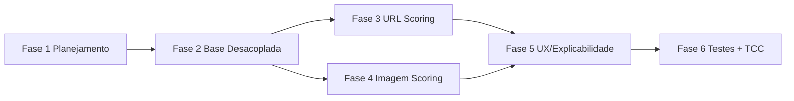
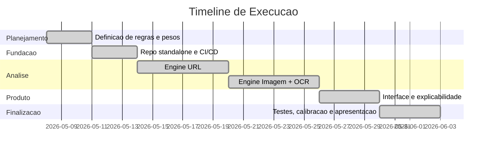

# 🗺️ ROADMAP — CadenceCode SafeCheck

## Visão Macro

## Timeline

## Status por Fase
- ✅ Fase 1: Planejamento e escopo do MVP sem IA.
- ✅ Fase 2: Concluída (repo standalone + deploy Vercel + remoto GitHub).
- ✅ Fase 3: Concluída (Engine de análise de URL por heurísticas BR).
- ✅ Fase 4: Concluída (Engine de análise de imagem + extração OCR local).
- ✅ Fase 5: Concluída (Interface de explicabilidade e score visual).
- ✅ Fase 6: Concluída (Bateria de testes automatizados Vitest + Roteiro de banca).
