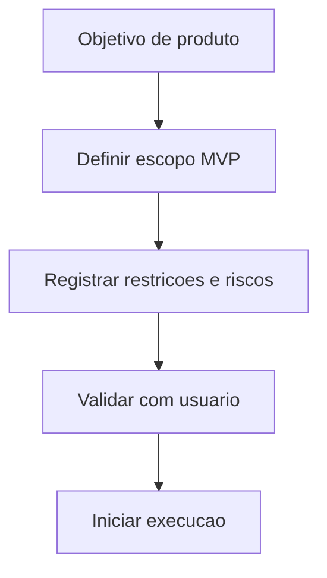

# ✅ Task: Definir Escopo MVP Sem IA

## Descrição
Formalizar escopo do produto para iniciar com heurísticas determinísticas e custo mínimo.

## Estado Atual
Ideia validada em conversa, sem documentação operacional versionada.

## Estado Desejado
Escopo, roadmap e critérios de sucesso documentados e aprovados para execução.

## Análise de Impacto
- Impacta arquitetura (sem IA neste ciclo).
- Impacta comunicação do produto (score como estimativa).
- Impacta cronograma (reduz tempo e complexidade inicial).

## Fluxo de Execução

## Passos de Implementação
1. **Consolidar escopo funcional**
   - O que fazer: definir entradas, saídas e limitações.
   - Como validar: checklist no `docs/PLANO.md`.
   - Rollback se falhar: reabrir critérios e recalibrar escopo.

2. **Registrar decisões arquiteturais**
   - O que fazer: criar log de decisões (ADR simplificado).
   - Como validar: `docs/DECISOES.md` atualizado.
   - Rollback se falhar: revisar decisão e marcar status como pendente.

## Testes Necessários
- [x] Validação manual do escopo com usuário.
- [x] Revisão de consistência entre PLANO, ROADMAP e TASKS.

## Definição de Pronto (DoD)
- [x] Escopo aprovado.
- [x] Riscos explícitos.
- [x] Dependências listadas.
- [x] Documentação inicial criada.
- [x] Sem ambiguidade crítica pendente.
