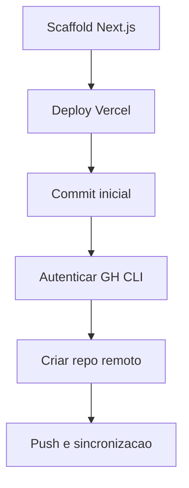

# ✅ Task: Estruturar Projeto Standalone

## Descrição
Criar projeto desacoplado da base atual, preparar deploy público e conectar fluxo de versionamento.

## Estado Atual
- Bootstrap Next.js 16 concluído em `C:\Users\Mauricio\Documents\GitHub\cadencecode-safecheck`.
- Deploy de produção ativo no Vercel.
- Commit inicial realizado localmente.
- Repositório GitHub criado e branch publicada.

## Estado Desejado
Projeto standalone com remoto GitHub configurado e push do commit inicial.

## Análise de Impacto
- Permite evolução independente do produto.
- Separa contexto acadêmico do produto público da CadenceCode.
- Habilita fluxo CI/CD baseado em Git.

## Fluxo de Execução

## Passos de Implementação
1. **Bootstrap local**
   - O que fazer: criar app standalone Next.js 16.
   - Como validar: build e estrutura gerada.
   - Rollback se falhar: recriar projeto com flags explícitas.

2. **Deploy Vercel**
   - O que fazer: publicar primeira versão.
   - Como validar: URL pública respondendo.
   - Rollback se falhar: revisar setup e repetir deploy.

3. **Repo remoto GitHub**
   - O que fazer: autenticar `gh`, criar repo e enviar branch.
   - Como validar: `git remote -v` e branch publicada.
   - Rollback se falhar: criar repo manual no GitHub e usar `git remote add origin`.

## Testes Necessários
- [x] Build em produção no Vercel.
- [x] Verificação de URL pública ativa.
- [x] Push no repositório remoto GitHub.

## Definição de Pronto (DoD)
- [x] Projeto standalone criado.
- [x] Deploy Vercel realizado.
- [x] Commit inicial criado.
- [x] Repo remoto GitHub criado e integrado.
