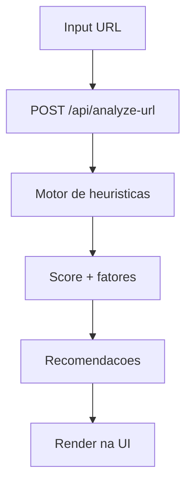

# ✅ Task: Implementar URL Scoring v1 (Sem IA)

## Descrição
Implementar análise heurística de URLs com score de segurança, fatores explicáveis e recomendações acionáveis.

## Estado Atual
- Endpoint `POST /api/analyze-url` implementado no projeto standalone.
- Motor heurístico criado com regras e pesos em módulo dedicado.
- Interface MVP conectada ao endpoint e exibindo resultado completo.

## Estado Desejado
Fluxo URL funcional em produção para uso de demonstração e coleta de feedback.

## Análise de Impacto
- Entrega a primeira funcionalidade principal do produto.
- Permite validar comunicação do score no TCC.
- Cria base reaproveitável para evolução futura com IA.

## Fluxo de Execução

## Passos de Implementação
1. **Motor heurístico**
   - O que fazer: criar regras determinísticas e pesos.
   - Como validar: testes manuais com URLs benignas e suspeitas.
   - Rollback se falhar: reduzir conjunto de regras para baseline.

2. **Endpoint de análise**
   - O que fazer: expor rota POST com validação de payload.
   - Como validar: respostas 200/400 com mensagens consistentes.
   - Rollback se falhar: isolar parser e simplificar tratamento.

3. **UI de resultado**
   - O que fazer: formulário + exibição de score/fatores/dicas.
   - Como validar: jornada ponta a ponta no ambiente local e Vercel.
   - Rollback se falhar: manter endpoint e simplificar front temporariamente.

## Testes Necessários
- [x] `npm run lint`
- [x] `npm run build`
- [x] Deploy de produção atualizado no Vercel

## Definição de Pronto (DoD)
- [x] Endpoint funcional em produção.
- [x] Score com faixas de risco (baixo/médio/alto).
- [x] Explicabilidade por fatores.
- [x] Recomendações exibidas ao usuário.
