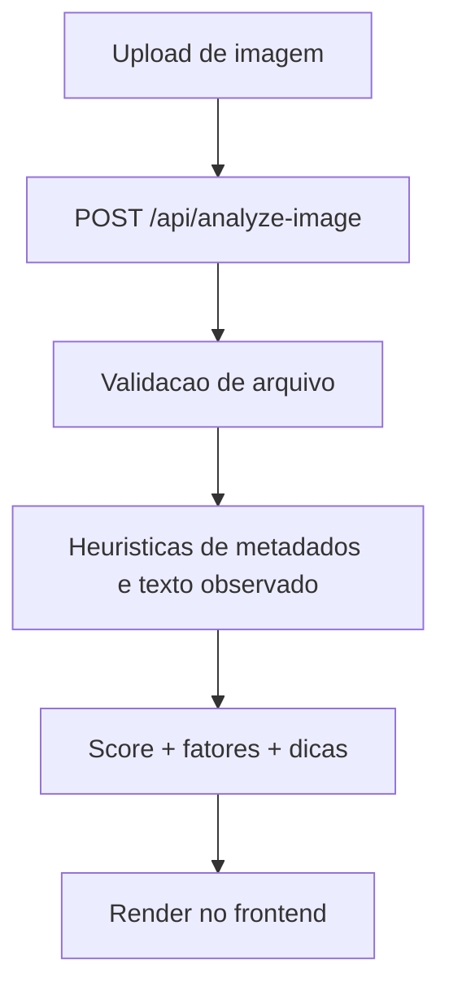

# ✅ Task: Implementar Image Scoring v1 (Sem IA)

## Descrição
Implementar análise heurística de prints/imagens com score de segurança e recomendações.

## Estado Atual
- Endpoint `POST /api/analyze-image` implementado com upload via `formData`.
- Validação de tipo/limite de arquivo e runtime Node.js no route handler.
- Motor heurístico de imagem criado com sinais de resolução, proporção, tamanho e texto observado.
- UI integrada para upload e visualização de score/fatores/recomendações.

## Estado Desejado
Fluxo de análise de imagem funcional em produção e pronto para demonstração no TCC.

## Análise de Impacto
- Fecha o segundo pilar principal do MVP (URL + Imagem).
- Aumenta utilidade prática para prints de golpes e mensagens suspeitas.
- Mantém custo zero sem dependência de IA treinada.

## Fluxo de Execução

## Testes Necessários
- [x] `npm run lint`
- [x] `npm run build`
- [x] Deploy de produção no Vercel

## Definição de Pronto (DoD)
- [x] Endpoint de imagem funcional.
- [x] Fluxo de upload integrado na UI.
- [x] Resultado explicável (fatores e recomendações).
- [x] Publicado em produção.
